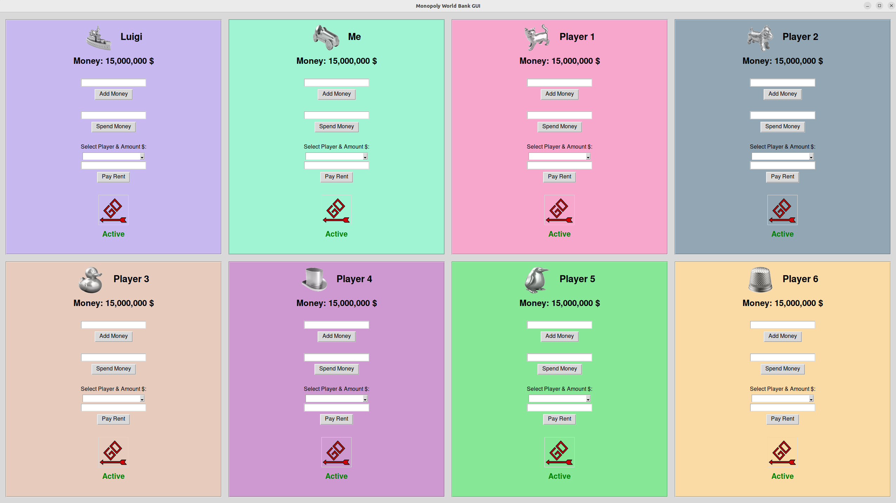
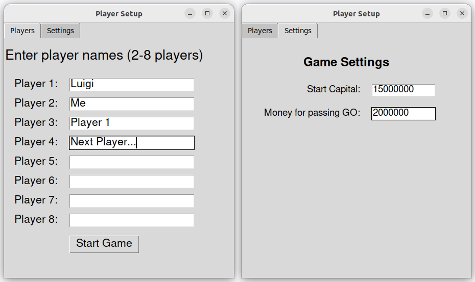

# <div align="center">Monopoly World</div>

<div align="center">
  <p>

   This is a Python code for a simplified Monopoly World card reader device.
   The game is available for 2-6 players, just like the original. 
   
   Game instructions: [**Monopoly World**](https://www.libble.de/hasbro-monopoly---world/p/883791/)
  </p>
</div>

<br />



<br />

Used Libraries:

- tkinter: The standard Python library for creating graphical user interfaces.

Installation:
```
pip install tkinter
```
<br />

<div align="center"> 
<h2>Launch the Game</h2>
 <p> Start the <strong>monopoly.py</strong> script to begin the game. </p>
  <p> Choose your layout via the <strong>Setup Menu</strong>: </p>  <p> Enjoy the game and have fun! </p> </div>


<br />
<br />

 # <div align="center">Environments</div>

<div align="center">
  <a href="https://code.visualstudio.com/" style="text-decoration:none; margin: 0 20px;">
    
  </a>
  <a href="https://www.python.org/" style="text-decoration:none; margin: 0 20px;">
    
  </a>
  <a href="https://about.gitlab.com/" style="text-decoration:none; margin: 0 20px;">
    
  </a>
  <br/><br/>
</div>