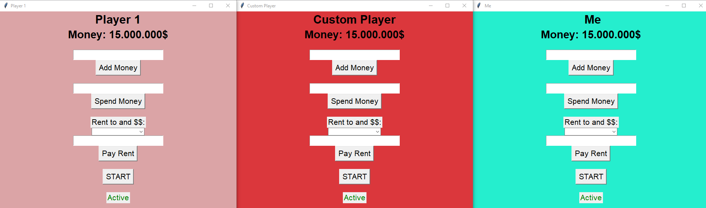

# <div align="center">Monopoly World</div>

<div align="center">
  <p>

   This is a Python code for a simplified Monopoly World card reader device.
   The game is available for 2-6 players, just like the original. 
   
   Game instructions: [**Monopoly World**](https://www.libble.de/hasbro-monopoly---world/p/883791/)
  </p>
</div>

<br />



<br />

Used Libraries:

- tkinter: The standard Python library for creating graphical user interfaces.

Installation:
```
pip install tkinter
```


<br />


<div align="center">
  <h2>Launch the game</h2>
  <p>
    Start the <strong>monopoly_GUI.py</strong>
  </p>
</div>


<br />
<br />

 # <div align="center">Environments</div>

<div align="center">
  <a href = "https://code.visualstudio.com/" style="text-decoration:none;">
    </a>
  <a href = "https://www.python.org/" style="text-decoration:none;">
    </a>
  <a href = "https://about.gitlab.com/" style="text-decoration:none;">
    </a>


<br/>
<br/>